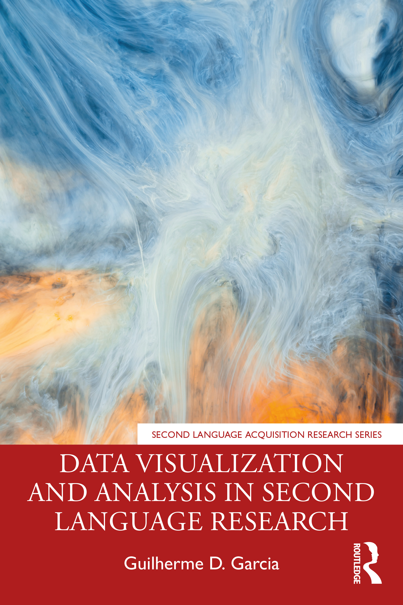

class: inverse, center, middle

# A figure is worth a thousand words
## Data visualization in second language research
### Guilherme D. Garcia


#### Newcastle University

<br>

#### University of Southampton, March 2022


---


```{r xaringan-tile-view, echo=FALSE}
xaringanExtra::use_tile_view()
xaringanExtra::use_scribble()
options(htmltools.dir.version = FALSE)
xaringanExtra::use_editable()
```


class: inverse, center, middle

# Why figures matter

---

# Why figures matter

.pull-left[

## Research stages

1. To <span style="color:FireBrick">***explore***</span> our own data
2. To <span style="color:FireBrick">***define***</span> the appropriate analysis
3. To <span style="color:FireBrick">***communicate***</span> our findings effectively


## Rules of thumb

- Be visually clear
- Don't oversimplify the data
- Find the "sweet spot" of information content

]

.pull-right[

```{r, fig.height=5, dev='svg', fig.align='center', echo=F, message = F}
library(tidyverse)

ggplot(data = tibble(x = c(-2.5, 2.5)),
       aes(x = x)) + 
  stat_function(fun = dnorm) +
  stat_function(fun = dnorm,
                xlim = c(-0.7, 0.7),
                geom = "area",
                alpha = 0.3) +
  theme_classic() + 
  theme(axis.ticks = element_blank(),
        axis.text = element_blank(),
        text = element_text(size = 18)) +
  labs(y = "Figure efficiency",
       x = "Amount of information in figure")

```
]


---

# Our goal today

.pull-left[
- Go over a simple study on **feedback**
- Explore patterns
- Assess the stats
- Report findings

## Files

- Slides at <a href = "http://guilhermegarcia.github.io" target = "_blank">`guilhermegarcia.github.io`</a>
- We will use some hypothetical data
- Download the data at <a href = "http://osf.io/hpt4g" target = "_blank">`http://osf.io/hpt4g`</a>
- File name: `dataFiles.zip`
- Our data $\rightarrow$ `feedback.csv`

]

.pull-right[
<p style="text-align:center;"></p>

]

---


# Our data

## Some data wrangling first

- Once we load our data, we can see it has a **wide format**
- That means a single variable (task item) spans across **multiple columns**
- This is a problem for plotting and analyzing the data

```{r, echo = F, message = F}
library(kableExtra)
d = read_csv("feedbackData.csv")

knitr::kable(head(d, n = 2), "html", caption = "Wide format") %>% scroll_box(width = "900px", height = "200px") %>% 
  kable_styling(position = "center")

```

- What we need is a table where each column represents a variable (`tidy format`)
- We can easily accomplish that using the `pivot_longer()` function in R from the <mark>`tidyverse`</mark> package


---

# Our tidy data

```{r, message = F, echo = T}
dLong = d %>% 
  pivot_longer(names_to = "Task", #<<
               values_to = "Score", #<<
               cols = task_A1:task_B5) %>% #<<
  mutate(Task = str_sub(Task, start = -2L, end = -1L ),
         Item = str_sub(Task, start = -1L, end = -1L),
         Task = str_sub(Task, start = -2L, end = -2L)) %>% 
  select(ID:Task, Item, Score)
```

```{r, message = F, echo = F}
dLong = dLong %>% 
  mutate(across(where(is.character), as.factor))
knitr::kable(head(dLong, n = 5), "html", caption = "Long format (tidy data)")
```


---

# Data structure
.pull-left[
- 2 tasks, each with 5 items
- Each item has a score

]

.pull-right[
- 60 learners of English L2
- 3 native languages (Japanese, Italian, German)

]

## Our focus

.pull-left[
- Is there an effect of `[var]` on `Score`?
- `[var]` needs to be theoretically informed
]

.pull-right[
- **`L1`, `Hours`, and `Feedback`**
- They will be our **main predictors**
]

<br>

```{r, message = F, echo = F}
knitr::kable(head(dLong, n = 3), "html", caption = "Long format (tidy data)")
```


---

class: inverse, center, middle

# Efficiency in data visualization

---

# Data visualization 😞

- Here's an **inefficient** figure: only one variable is shown (`Feedback`)
- Only averages are displayed; no uncertainty around the mean (error bars)

.pull-left[
```{r, fig.height=5, dev='svg', fig.align='center', echo=F, message = F}
ggplot(data = dLong, aes(x = Feedback, y = Score)) + 
  stat_summary(fun = mean, geom = "bar", 
               alpha = 0.5, color = "black",
               width = 0.5) +
  theme_classic() +
  theme(text = element_text(size = 18))
```
]

.pull-right[
```{r, fig.height=5, dev='svg', fig.align='center', echo=F, message = F}
ggplot(data = tibble(x = c(-2.5, 2.5)),
       aes(x = x)) + 
  stat_function(fun = dnorm) +
  stat_function(fun = dnorm,
                xlim = c(-0.7, 0.7),
                geom = "area",
                alpha = 0.3) +
  stat_function(fun = dnorm,
                xlim = c(-2, -2),
                geom = "point",
                alpha = 1, size = 8,
                color = "red") +
  theme_classic() + 
  theme(axis.ticks = element_blank(),
        axis.text = element_blank(),
        text = element_text(size = 18)) +
  labs(y = "Figure efficiency",
       x = "Amount of information in figure")
```
]

---

# Data visualization 😕

- This is better, but notice how `Feedback` looks drastically different now
- Here we're showing the standard errors (SEs) from the means

.pull-left[
```{r, fig.height=5, dev='svg', fig.align='center', echo=F, message = F}
ggplot(data = dLong, aes(x = Feedback, y = Score)) + 
  stat_summary() +
  theme_classic() +
  theme(text = element_text(size = 18))
```
]

.pull-right[
```{r, fig.height=5, dev='svg', fig.align='center', echo=F, message = F}
ggplot(data = tibble(x = c(-2.5, 2.5)),
       aes(x = x)) + 
  stat_function(fun = dnorm) +
  stat_function(fun = dnorm,
                xlim = c(-0.7, 0.7),
                geom = "area",
                alpha = 0.3) +
  stat_function(fun = dnorm,
                xlim = c(-1.5, -1.5),
                geom = "point",
                alpha = 1, size = 8,
                color = "red") +
  theme_classic() + 
  theme(axis.ticks = element_blank(),
        axis.text = element_blank(),
        text = element_text(size = 18)) +
  labs(y = "Figure efficiency",
       x = "Amount of information in figure")
```
]

---

# Data visualization 🥰

- This is even better, as box plots give us more information
- We now have medians and data dispersion as well as means and SEs

.pull-left[
```{r, fig.height=5, dev='svg', fig.align='center', echo=F, message = F}
ggplot(data = dLong, aes(x = Feedback, y = Score)) + 
  geom_boxplot() +
  stat_summary() +
  theme_classic() +
  theme(text = element_text(size = 18))
```
]

.pull-right[
```{r, fig.height=5, dev='svg', fig.align='center', echo=F, message = F}
ggplot(data = tibble(x = c(-2.5, 2.5)),
       aes(x = x)) + 
  stat_function(fun = dnorm) +
  stat_function(fun = dnorm,
                xlim = c(-0.7, 0.7),
                geom = "area",
                alpha = 0.3) +
  stat_function(fun = dnorm,
                xlim = c(-0.75, -0.75),
                geom = "point",
                alpha = 1, size = 8,
                color = "red") +
  theme_classic() + 
  theme(axis.ticks = element_blank(),
        axis.text = element_blank(),
        text = element_text(size = 18)) +
  labs(y = "Figure efficiency",
       x = "Amount of information in figure")
```
]


---

# Data visualization 😍

- Now we also have information on `Task` (no apparent interaction with `Feedback`)
- This allows us to inspect the effects of two variables on `Score`

.pull-left[
```{r, fig.height=5, dev='svg', fig.align='center', echo=F, message = F}
ggplot(data = dLong, aes(x = Feedback, y = Score)) + 
  geom_boxplot(aes(fill = Task)) +
  stat_summary(aes(group = Task), 
               position = position_dodge(width = 0.75),
               color = "black") +
  theme_classic() +
  theme(legend.position = "top") +
  scale_fill_manual(values = c("white", "gray")) +
  theme(text = element_text(size = 18))
```
]

.pull-right[
```{r, fig.height=5, dev='svg', fig.align='center', echo=F, message = F}
ggplot(data = tibble(x = c(-2.5, 2.5)),
       aes(x = x)) + 
  stat_function(fun = dnorm) +
  stat_function(fun = dnorm,
                xlim = c(-0.7, 0.7),
                geom = "area",
                alpha = 0.3) +
  stat_function(fun = dnorm,
                xlim = c(-0.25, -0.25),
                geom = "point",
                alpha = 1, size = 8,
                color = "red") +
  theme_classic() + 
  theme(axis.ticks = element_blank(),
        axis.text = element_blank(),
        text = element_text(size = 18)) +
  labs(y = "Figure efficiency",
       x = "Amount of information in figure")
```
]

---

# Data visualization 🤯

- Now we add information on the `L1` (means): no clear effect (text now hides means and SEs)
- Total variables: `Score ~ Feedback + Task + L1` (all predictors are **categorical** here)

.pull-left[
```{r, fig.height=5, dev='svg', fig.align='center', echo=F, message = F}
ggplot(data = dLong, aes(x = Feedback, y = Score, label = L1)) + 
  geom_boxplot(aes(fill = Task)) +
  stat_summary(aes(group = Task), 
               position = position_dodge(width = 0.75),
               color = "black") +
  geom_text(d = dLong %>% 
              group_by(Feedback, Task, L1) %>% 
              summarize(Score = mean(Score)),
            position = position_dodge(width = 0.75),
            aes(group = Task), color = "blue") +
  theme_classic() +
  theme(legend.position = "top") +
  scale_fill_manual(values = c("white", "gray")) +
  theme(text = element_text(size = 18))
```
]

.pull-right[
```{r, fig.height=5, dev='svg', fig.align='center', echo=F, message = F}
ggplot(data = tibble(x = c(-2.5, 2.5)),
       aes(x = x)) + 
  stat_function(fun = dnorm) +
  stat_function(fun = dnorm,
                xlim = c(-0.7, 0.7),
                geom = "area",
                alpha = 0.3) +
  stat_function(fun = dnorm,
                xlim = c(0.45, 0.45),
                geom = "point",
                alpha = 1, size = 8,
                color = "red") +
  theme_classic() + 
  theme(axis.ticks = element_blank(),
        axis.text = element_blank(),
        text = element_text(size = 18)) +
  labs(y = "Figure efficiency",
       x = "Amount of information in figure")
```
]

---

# Data visualization 🤒

- Here we see individual data points (too much information)
- Total variables: `Score ~ Feedback + Task + L1 + ID`

.pull-left[
```{r, fig.height=5, dev='svg', fig.align='center', echo=F, message = F}
ggplot(data = dLong, aes(x = Feedback, y = Score, label = L1)) + 
  geom_boxplot() +
  stat_summary(aes(group = Task), 
               position = position_dodge(width = 0.75),
               color = "black") +
  geom_text(d = dLong %>% 
              group_by(Feedback, Task, L1) %>% 
              summarize(Score = mean(Score)),
            position = position_dodge(width = 0.75),
            aes(group = Task), color = "blue") +
  # stat_summary(aes(group = Item), geom = "line") +
  geom_jitter(alpha = 0.2, aes(group = ID)) +
  theme_classic() +
  facet_grid(~Task, labeller = "label_both") +
  theme(legend.position = "top") +
  scale_fill_manual(values = c("white", "gray")) +
  theme(text = element_text(size = 18))
```
]

.pull-right[
```{r, fig.height=5, dev='svg', fig.align='center', echo=F, message = F}
ggplot(data = tibble(x = c(-2.5, 2.5)),
       aes(x = x)) + 
  stat_function(fun = dnorm) +
  stat_function(fun = dnorm,
                xlim = c(-0.7, 0.7),
                geom = "area",
                alpha = 0.3) +
  stat_function(fun = dnorm,
                xlim = c(1.2, 1.2),
                geom = "point",
                alpha = 1, size = 8,
                color = "red") +
  theme_classic() + 
  theme(axis.ticks = element_blank(),
        axis.text = element_blank(),
        text = element_text(size = 18)) +
  labs(y = "Figure efficiency",
       x = "Amount of information in figure")
```
]

---

class: inverse, center, middle

# Which variables to focus on?

---

# Selecting variables

- We can use **classification trees** as *one* method to check which variables matter overall
- `Score ~ L1 + Sex + Hours + Feedback + Task` using `ctree()` from <mark>`party`</mark>

```{r, message=F, echo=F, dev="svg", fig.align='center', fig.width=12, fig.height=5}
library(party)

fit = ctree(Score ~ L1 + Sex + Hours + Feedback + Task, data = dLong)
plot(fit,
     inner_panel = node_inner,
     ip_args = list(
       abbreviate = F,
       id = F,
       fill = "gray80"), 
     tp_args = list(col = "black", width = 0.25,
                    fill = alpha(c("gray70", "gray50", "gray30"))))
```

---

# Zooming in on our key variables

- How does `Hours` affect `Score`? More hours $\rightarrow$ better scores
- What if we add `Feedback`? `Recast` seems to be better than `Explicit correction`, but **not always**

.pull-left[
```{r, message=F, echo=F, dev="svg", fig.align='center', fig.width=7, fig.height=4.5}

ggplot(data = dLong, aes(x = Hours, y = Score)) + 
  geom_point(alpha = 0.05, size = 4) + 
  geom_smooth(method = lm) + 
  theme_classic() +
  theme(legend.position = "top") +
  theme(text = element_text(size = 18))
  # scale_color_manual(values = c("red", "blue")) +
  # geom_vline(xintercept = 14.6, linetype = "dashed")
```
]

.pull-right[
```{r, message=F, echo=F, dev="svg", fig.align='center', fig.width=7, fig.height=4.5}

ggplot(data = dLong, aes(x = Hours, y = Score)) + 
  geom_point(alpha = 0.05, size = 4) + 
  geom_smooth(method = lm, aes(color = Feedback)) + 
  theme_classic() +
  theme(legend.position = "top") +
  theme(text = element_text(size = 18)) +
  scale_color_manual(values = c("orange", "brown"))
  # geom_vline(xintercept = 14.6, linetype = "dashed")
```
]

- Now we have a better sense of what to include in our analysis

???

- Notice that points aren't colored 
- That would be too cluttered; no clear visual separation with this data

---


class: inverse, center, middle

# Statistical analysis

---

# Running our mixed-effects model

- Our tree suggests that `Hours` and `Feedback` matter, so let's focus on them
- Let's run our statistical model now using `lmer()` from <mark>`lme4`</mark>
- Model: **`Score ~ Hours * Feedback + (1 | ID) + (1 | Item)`**


```{r, message = F, warning = F, echo = F}
library(sjPlot)
library(lme4)

model = lmer(Score ~ Hours * Feedback + 
               (1 | ID) + (1 | Item), data = dLong)

tab_model(model, show.r2 = T, 
          show.re.var = F, 
          show.icc = F, show.ngroups = F)
```

<br>

- We have significant effects for all our terms, **BUT** <span style = "color:red">**can't**</span> directly compare `Hours` and `Feedback`


---


# Running our mixed-effects model

- Here's the same model with both variables on the same scale
- We can easily rescale variables using `rescale()` from <mark>`arm`</mark>

```{r, message = F, warning = F, echo = F}
library(arm)
dLong = dLong %>% 
  mutate(`Hours (std)` = rescale(Hours),
         `Feedback (std)` = rescale(Feedback))

model.std = lmer(Score ~ `Hours (std)` * Feedback + 
               (1 | ID) + (1 | Item), data = dLong)

tab_model(model.std, show.r2 = T,
          show.re.var = F, 
          # CSS = list(css.firsttablecol = "width: 50%"),
          show.icc = F, show.ngroups = F)
```

<br>

- Now we see that `Hours` actually matters more than `Feedback` type

---

# Visualizing the interaction

- Back to our figure. Notice that each participant has 10 points in the figure (2 tasks $\times$ 5 items)
- It may be better if each point represents the *average* score of each participant across all 10 items

```{r, message=F, echo=F, dev="svg", fig.align='center', fig.width=7, fig.height=4.5}

ggplot(data = dLong, aes(x = Hours, y = Score)) + 
  geom_point(alpha = 0.05, size = 4) + 
  geom_smooth(method = lm, aes(color = Feedback)) + 
  theme_classic() +
  theme(legend.position = "top") +
  coord_cartesian(ylim = c(40, 100)) +
  theme(text = element_text(size = 18)) +
  scale_color_manual(values = c("orange", "brown")) +
  geom_vline(xintercept = 14.6, linetype = "dashed")
```

---

# Visualizing the interaction

- Now, each point = grand average of each participant
- Notice how participants' averages are clustered around our trend lines

```{r, message=F, echo=F, dev="svg", fig.align='center', fig.width=7, fig.height=4.5}

bySpeaker = dLong %>% 
  group_by(ID, Feedback, Hours) %>% 
  summarize(Score = mean(Score))

ggplot(data = dLong, aes(x = Hours, y = Score)) + 
  geom_point(data = bySpeaker, alpha = 0.4, 
             size = 4, aes(group = ID, 
                           color = Feedback)) + 
  geom_smooth(method = lm, aes(color = Feedback)) + 
  theme_classic() +
  coord_cartesian(ylim = c(40, 100)) +
  theme(legend.position = "top") +
  theme(text = element_text(size = 18)) +
  scale_color_manual(values = c("orange", "brown")) +
  geom_vline(xintercept = 14.6, linetype = "dashed")
```


---

# Visualizing our model output

- It's very easy to plot our model with `plot_model()` from `sjPlot`:

```{r, message=F, echo=T, dev="svg", fig.align='center', fig.width=7, fig.height=3.5}
plot_model(model.std, show.values = T) + #<<
  labs(title = NULL) + theme_classic() + theme(text = element_text(size = 20)) +
  geom_hline(yintercept = 0, linetype = "dashed")

```

---

# Two key figures

.pull-left[

- Our data: both variables of interest

```{r, message=F, echo=F, dev="svg", fig.align='center', fig.width=7, fig.height=4.5}

ggplot(data = dLong, aes(x = Hours, y = Score)) + 
  geom_point(data = bySpeaker, alpha = 0.4, 
             size = 4, aes(group = ID, 
                           color = Feedback)) + 
  geom_smooth(method = lm, aes(color = Feedback)) + 
  theme_classic() +
  coord_cartesian(ylim = c(40, 100)) +
  theme(legend.position = "top") +
  theme(text = element_text(size = 18)) +
  scale_color_manual(values = c("orange", "brown")) +
  geom_vline(xintercept = 14.6, linetype = "dashed")
```
]

.pull-right[

- Our model: estimates and confidence intervals
<br>

```{r, message=F, echo=F, dev="svg", fig.align='center', fig.width=7, fig.height=4.5}

dLong = dLong %>% 
  mutate(H = rescale(Hours),
         Fb = Feedback)

model.std = lmer(Score ~ H * Fb + 
               (1 | ID) + (1 | Item), data = dLong)

plot_model(model.std, show.values = T) + #<<
  labs(title = NULL) +
  theme_classic() +
  theme(text = element_text(size = 20)) +
  geom_hline(yintercept = 0, linetype = "dashed")
```
]

---

class: inverse, center, middle

# Summary

---

# Take-home message 📝

- Figures help us and readers understand data patterns
  - This is especially true when examining **interactions**
- They also provide an intuitive way to report model estimates

## Dos and Don'ts ❗️

- Maximize efficiency by balancing information and clarity
- Have clear labels and remove anything that is *unnecessary*
- Use colors and shapes to maximize **function** (or improve accessibility with `ggpattern`)
- "Align" figures and statistical analysis: they should complement each other
- Figures should always have **good resolution**

---

class: inverse, center, middle

# Extras: Bayes; interactive plots

---

# Same model, but now using Bayes

- Here, visualization is **even more important**, since estimates are distributions
- The areas below show the **posterior distribution** of all estimates
- Means and 95% highest density intervals (HDI) are also provided

<br>

```{r, message=F, echo=F, dev="svg", fig.align='center', fig.width=7, fig.height=3.5}
library(brms)
load("fitB.RData")

bayesplot::mcmc_areas(fitB, pars = c("b_H", "b_FbRecast",
                                     "b_H:FbRecast"),
                      prob = 0.95, point_est = "mean") +
  theme(text = element_text(family = "Arial", size = 18)) +
  labs(x = "Estimate")
```


---

# Interactive figures 

- There are different options in R; <mark>`plotly`</mark> is a great one

<div align = "center">
<iframe src="plotly.html" scrolling="no" seamless="seamless" align="center" frameBorder="0" height="400" width="60%"></iframe>
</div>

- This can be useful **if** interactivity serves a purpose 

---

class: inverse, center, middle

# Thank you!

### Questions 💭

#### `guilhermegarcia.github.io/CLLEAR/garcia_slides_cllear`